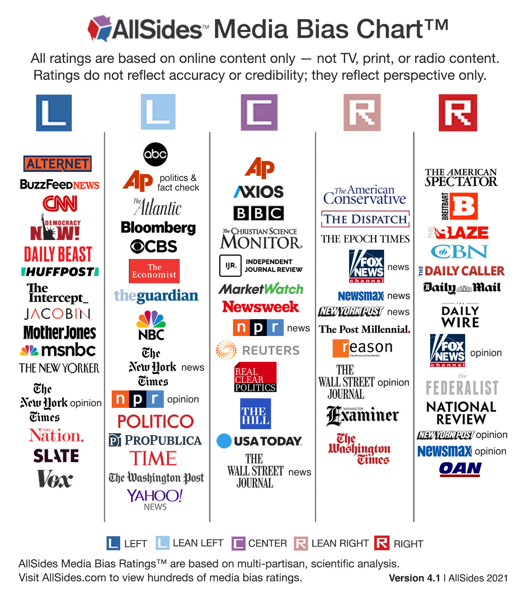

# NwsFx (NewsFix) 
Final project - Concordia Data Science Diploma (cb-ds-1)

The project is a complete implementation of an API that return a summary, bias metrics (left, right, opinion) and entities from any article urls.

## Prerequisites
```python
conda install flask
conda install -c conda-forge spacy
python -m spacy download en_core_web_sm
conda install -c anaconda nltk
#in python run: nltk.download('vader_lexicon')
conda install -c conda-forge newspaper3k
conda install -c conda-forge scikit-learn
conda install pandas
```

## How to run
- **Localy**
    - Install prerequisites
    - Run `python nwsfx_flask_app.py` in the terminal
    - Check the Demo notebook

- **AWS**
    - Create EC2 instance following the wizard
    - Create and Save SSH Key
    - EC2 > Instance > xxxx > Connect > SSH Client
    - in the SSH Client : follow instructions from AWS
    - wget http://repo.anaconda.com/miniconda/Miniconda3-latest-Linux-x86_64.sh
    - bash Miniconda*.sh
    - nano ~/.profile
    - export PATH="$HOME/anaconda3_linux/bin:$PATH"
    - exit / reconnect
    - conda install ...
    - git clone https://github.com/mendelevium/Final-Project
    - cd Final-Project
    - export FLASK_APP=nwsfx_flask_app.py
    - flask run --host=0.0.0.0

More infos on deployement in production:[codementor](https://www.codementor.io/@jqn/deploy-a-flask-app-on-aws-ec2-13hp1ilqy2)

## The Idea

We've seen a lot of biased media coverage in the last few years and the phenomenon seems to be accelerating. The filter bubble amplify respective views of readers by exposing them to even more biased content.



The idea is to break this cycle by creating a simple tool to identify bias in order to deliver a more balanced news feed to the readers.

## Data

Dataset: Quantifying News Media Bias through Crowdsourcing and Machine Learning Dataset (20k articles) [Source](https://deepblue.lib.umich.edu/data/concern/data_sets/8w32r569d?locale=en)

The dataset doesn't contain the text (only the url) so the articles must be scrape from 19 news outlets.

## Models

*Major components*:
    - Newspaper3k (articles extraction)
    - NLTK (sentiments analysis, lemmatizer)
    - Spacy (entities recognition, text processing)
    - Custom models (bias, opinion)

*Custom models*:
    - TF-IDF / SVM
    - FFNN
    - RNN (GRU, LSTM)
    
## API

The API is intended to be used as an input to create a better newsfeed.

Flask app with 3 simple POST methods using an URL as input:
    - /summary : return important informations about an article (date, author, title, summary, image)
    - /metrics : return the bias (left, rigth) and if the article is an opinion
    - /entities : return most frequent entities (subjects) in an article and the sentiment associated with it

